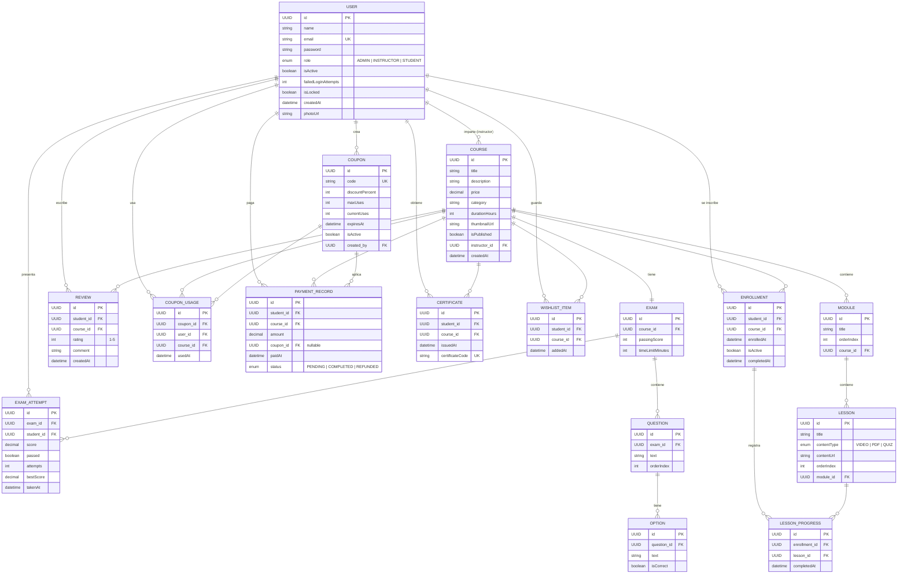

# Ndemy — Backend

> Plataforma de Cursos Online. API REST para la gestión de cursos, lecciones, estudiantes, inscripciones, pagos, exámenes y certificaciones.


**API en producción:** https://ndemy-backend.onrender.com/ · **Frontend:** https://ndemy-front-end.vercel.app/

---

## Tabla de contenido

- [Descripción](#descripción)
- [Características](#características)
- [Stack tecnológico](#stack-tecnológico)
- [Arquitectura](#arquitectura)
- [Patrón de escalabilidad: notificaciones (Strategy + Factory)](#patrón-de-escalabilidad-notificaciones-strategy--factory)
- [Modelo de datos y diagrama Entidad-Relación](#modelo-de-datos-y-diagrama-entidad-relación)
- [Ejecución local](#ejecución-local)
- [Variables de entorno](#variables-de-entorno)
- [Autenticación, roles y permisos](#autenticación-roles-y-permisos)
- [API](#api)
- [Formato de respuestas y códigos HTTP](#formato-de-respuestas-y-códigos-http)
- [Despliegue en la nube (Render)](#despliegue-en-la-nube-render)
- [Estructura del proyecto](#estructura-del-proyecto)

---

## Descripción

**Ndemy** es el backend de una plataforma de cursos en línea. Expone una API REST que permite a los **instructores** crear y publicar cursos (organizados en módulos y lecciones con un examen final), a los **estudiantes** comprar cursos, avanzar en su progreso, presentar el examen y obtener un certificado verificable, y a los **administradores** gestionar usuarios globales y consultar reportes de la plataforma.

El sistema cubre el ciclo completo: registro y autenticación con JWT, control de acceso por roles, pagos e inscripciones, cupones de descuento, reseñas, listas de deseos, exámenes con intentos limitados, generación automática de certificados y notificaciones por correo.

---

## Características

- **Gestión de cursos** organizados en módulos y lecciones (contenido de tipo VIDEO, PDF o QUIZ), con búsqueda paginada y filtros por categoría, precio y texto.
- **Inscripciones y progreso**: el contenido solo es accesible para estudiantes con pago completado; el progreso se registra lección por lección.
- **Exámenes**: un examen por curso, con preguntas de opción múltiple, intentos limitados y resultados detallados.
- **Certificados** verificables, emitidos automáticamente al aprobar el examen.
- **Pagos y reembolsos**, con soporte para **cupones de descuento** de uso limitado.
- **Reseñas y calificaciones**, y **listas de deseos** por estudiante.
- **Roles diferenciados** (administrador, instructor, estudiante) con control de acceso granular.
- **Reportes** de ingresos por instructor y un panorama global para administradores.
- **Notificaciones por correo** mediante un sistema de canales desacoplado y extensible.
- **Seguridad**: autenticación JWT *stateless*, contraseñas con BCrypt y bloqueo de cuenta por intentos fallidos.

Reglas de negocio destacadas:

- Un curso **no puede publicarse sin un examen** asociado.
- El examen solo se desbloquea con el **100 % de las lecciones completadas**.
- Máximo **3 intentos** de examen; al tercer fallo **se reinicia el progreso** del curso.
- Las preguntas y opciones se **barajan** para los estudiantes y se ocultan las respuestas correctas.
- El **reembolso** desactiva la inscripción de inmediato.
- Un cupón es de **un uso por usuario** y **no puede editarse** una vez tiene usos registrados.
- La cuenta se **bloquea tras 5 intentos** de inicio de sesión fallidos.

---

## Stack tecnológico

| Categoría | Tecnología |
|-----------|------------|
| Lenguaje | Java 21 |
| Framework | Spring Boot 3.2.5 |
| Seguridad | Spring Security + JWT (jjwt 0.11.5) |
| Persistencia | Spring Data JPA / Hibernate |
| Base de datos | PostgreSQL |
| Validación | Spring Boot Starter Validation (Jakarta Bean Validation) |
| Correo | Spring Boot Starter Mail (SMTP) |
| Documentación | springdoc-openapi (Swagger UI) |
| Utilidades | Lombok |
| Monitoreo | Spring Boot Actuator |
| Build | Maven (con wrapper `mvnw`) |
| Contenedor | Docker (build multi-stage) |

---

## Arquitectura

El proyecto sigue una **arquitectura por capas** con separación estricta de responsabilidades:

```
Controller  ->  Service (interfaz)  ->  ServiceImpl  ->  Repository  ->  Entity (JPA)
     |                                                                    |
DTOs (request / response)                              Base de datos (PostgreSQL)
```

- **Controllers** (`controllers/`): exponen los endpoints REST. Reciben y devuelven **DTOs**, nunca entidades. Todos quedan bajo el prefijo `/api` gracias a `ApiPathConfig`.
- **Services** (`services/` + `services/serviceImpl/`): contienen la lógica de negocio. Se programa contra la interfaz y se inyecta la implementación.
- **Repositories** (`repositories/`): interfaces de Spring Data JPA.
- **Models** (`models/`): entidades JPA con identificadores `UUID`.
- **DTOs** (`dto/request`, `dto/response`): contratos de entrada/salida con validaciones declarativas.
- **Exceptions** (`exceptions/`): excepciones de negocio + un `GlobalExceptionHandler` (`@RestControllerAdvice`) que traduce cada excepción a su código HTTP correspondiente.
- **Security** (`security/`): filtro JWT, servicio de tokens y configuración de Spring Security.
- **Utils** (`utils/`): `ResponseBuilder` (envuelve toda respuesta en un formato uniforme) y `OrderIndexUtil` (gestión de orden de módulos/lecciones/preguntas).

Detalles transversales:

- **Respuestas uniformes**: todo endpoint de negocio responde con el envoltorio `GeneralResponse` (`uri`, `message`, `status`, `time`, `data`).
- **Manejo de errores centralizado**: las excepciones de negocio se mapean a códigos HTTP semánticos (404, 409, 403, 400, 401, 423…).
- **CORS configurable** por variable de entorno (`CORS_ORIGINS`).

---

## Patrón de escalabilidad: notificaciones (Strategy + Factory)

Para evitar que los canales de notificación (email, SMS, push) se mezclen con la lógica de negocio mediante condicionales, el sistema de notificaciones combina los patrones **Strategy** y **Factory**:

```
        NotificationService      (lógica de negocio: "¿qué notificar?")
                 |
        NotificationDispatcher   (Factory/registro: Map<Tipo, Canal>)
                 |
     +-----------+-----------+
     |           |           |
 EmailChannel SmsChannel PushChannel   (Strategy: "¿cómo enviar?")
```

- `NotificationChannel` es la **interfaz Strategy**; cada canal (`EmailNotificationChannel`, `SmsNotificationChannel`, `PushNotificationChannel`) la implementa.
- `NotificationDispatcher` actúa como **Factory/registro**: Spring inyecta la lista de canales y construye un `Map<NotificationChannelType, NotificationChannel>`, eligiendo el canal correcto en tiempo de ejecución sin un solo `if`.
- Agregar un canal nuevo (p. ej. WhatsApp) solo requiere crear una clase que implemente la interfaz: **no se toca la lógica de negocio** (principio Abierto/Cerrado).
- Una notificación fallida **nunca rompe la operación de negocio**: el `dispatch` captura cualquier excepción y la registra.

---

## Modelo de datos y diagrama Entidad-Relación

El sistema tiene 16 entidades. Todas usan clave primaria `UUID`.



Restricciones de unicidad relevantes: `reviews(student_id, course_id)`, `coupon_usage(coupon_id, user_id)`, `wishlist_items(student_id, course_id)`, `users.email`, `coupons.code`, `certificates.certificate_code`.

---

## Ejecución local

### Requisitos previos

- Java 21 (JDK)
- Maven (o usar el wrapper `./mvnw` incluido)
- PostgreSQL en ejecución
- Docker (opcional, para correr en contenedor)

### Opción A — Maven

```bash
# 1. Definir las variables de entorno (ver sección "Variables de entorno")
export DB_URL=<url-jdbc-de-postgresql>
export DB_USER=<usuario-bd>
export DB_PASSWORD=<password-bd>
export JWT_SECRET=<clave-de-minimo-32-caracteres>
export MAIL_USERNAME=<correo-emisor>
export MAIL_PASSWORD=<password-correo>
export CORS_ORIGINS=<origen-del-frontend>

# 2. Compilar y ejecutar
./mvnw clean spring-boot:run
```

La aplicación arranca en `http://localhost:8080`.

### Opción B — Docker

```bash
# Construir la imagen
docker build -t ndemy-backend .

# Ejecutar el contenedor pasando las variables de entorno
docker run -p 8080:8080 \
  -e DB_URL=<url-jdbc-de-postgresql> \
  -e DB_USER=<usuario-bd> \
  -e DB_PASSWORD=<password-bd> \
  -e JWT_SECRET=<clave-de-minimo-32-caracteres> \
  -e MAIL_USERNAME=<correo-emisor> \
  -e MAIL_PASSWORD=<password-correo> \
  -e CORS_ORIGINS=<origen-del-frontend> \
  ndemy-backend
```

### Documentación interactiva (Swagger)

Con la aplicación corriendo, la documentación interactiva de la API está disponible en:

- **Swagger UI**: `http://localhost:8080/swagger-ui.html`
- **OpenAPI JSON**: `http://localhost:8080/v3/api-docs`

---

## Variables de entorno

| Variable | Descripción |
|----------|-------------|
| `DB_URL` | URL JDBC de PostgreSQL |
| `DB_USER` | Usuario de la base de datos |
| `DB_PASSWORD` | Contraseña de la base de datos |
| `JWT_SECRET` | Clave de firma JWT (mínimo 32 caracteres) |
| `MAIL_USERNAME` | Usuario SMTP (correo emisor) |
| `MAIL_PASSWORD` | Contraseña SMTP |
| `CORS_ORIGINS` | Orígenes permitidos, separados por coma |
| `PORT` | Puerto del servidor (opcional, por defecto `8080`) |

> El correo está configurado para SMTP de Outlook (`smtp-mail.outlook.com:587`).
> La aplicación valida al arrancar que `JWT_SECRET` tenga al menos 32 caracteres.
> Las credenciales se configuran como variables de entorno y **nunca** se incluyen en el repositorio.

---

## Autenticación, roles y permisos

### Flujo de autenticación (JWT)

1. El cliente hace `POST /api/auth/login` o `/register` y recibe un **access token** y un **refresh token**.
2. El **access token** (vigencia 15 min) se envía en cada petición protegida:
   `Authorization: Bearer <access_token>`.
3. Cuando expira, se obtiene uno nuevo con `POST /api/auth/refresh` enviando el **refresh token** (vigencia 7 días) en el header `Authorization`.

Otras características de seguridad: contraseñas cifradas con **BCrypt**, sesiones **stateless**, y **bloqueo de cuenta** tras 5 intentos de login fallidos.

### Roles

| Rol | Descripción |
|-----|-------------|
| `ADMIN` | Gestiona usuarios globales, modera reseñas y consulta reportes de la plataforma. |
| `INSTRUCTOR` | Crea y gestiona sus cursos, módulos, lecciones, exámenes y cupones; ve sus reportes. |
| `STUDENT` | Compra cursos, avanza, reseña, gestiona su wishlist y obtiene certificados. |

### Matriz de acceso (resumen)

| Recurso | Público | STUDENT | INSTRUCTOR | ADMIN |
|---------|:------:|:-------:|:----------:|:-----:|
| Listar / ver cursos | ✓ | ✓ | ✓ | ✓ |
| Crear/editar curso, módulo, lección, examen | | | ✓ (dueño) | |
| Comprar / reembolsar | | ✓ | | |
| Presentar examen | | ✓ | | |
| Reseñas (crear) | | ✓ | | |
| Wishlist | | ✓ | | |
| Cupones (gestión) | | | ✓ | ✓ |
| Reporte de ingresos | | | ✓ | |
| Gestión de usuarios / reporte global | | | | ✓ |

---

## API

- **Base URL:** `{host}/api`
- **Autenticación:** las rutas protegidas requieren el header `Authorization: Bearer <token>`.
- **Documentación completa e interactiva:** disponible en **Swagger UI** (`/swagger-ui.html`), generada automáticamente desde el código. Es la fuente de verdad para los contratos de cada endpoint (parámetros, cuerpos y respuestas).

La API se organiza en los siguientes módulos:

| Módulo | Ruta base | Descripción |
|--------|-----------|-------------|
| Autenticación | `/api/auth` | Registro, login y renovación de tokens. |
| Perfil | `/api/users/me` | Consulta y edición del perfil propio. |
| Administración de usuarios | `/api/admin/users` | Gestión global de usuarios (solo ADMIN). |
| Cursos | `/api/courses` | Catálogo, creación, publicación y gestión de cursos. |
| Módulos y lecciones | `/api/modules`, `/api/lessons` | Estructura y contenido de los cursos. |
| Exámenes | `/api/courses/{id}/exam` | Examen del curso, preguntas y opciones. |
| Inscripciones y progreso | `/api/students/me` | Cursos del estudiante, progreso y certificados. |
| Instructor | `/api/instructor/me` | Cursos y estudiantes del instructor. |
| Pagos | `/api/payment` | Compra de cursos y reembolsos. |
| Cupones | `/api/coupons` | Gestión y previsualización de cupones. |
| Reseñas | `/api/courses/{id}/reviews` | Reseñas y calificaciones de cursos. |
| Wishlist | `/api/wishlist` | Lista de deseos del estudiante. |
| Certificados | `/api/certificates` | Verificación de certificados. |
| Reportes | `/api/instructor/reports`, `/api/admin/reports` | Reportes de ingresos y panorama global. |

---

## Formato de respuestas y códigos HTTP

### Respuesta exitosa (`GeneralResponse`)

```json
{
  "uri": "/api/courses",
  "message": "Courses found successfully",
  "status": 200,
  "time": "2025-06-28T14:30:00",
  "data": { }
}
```

### Respuesta de error (`ApiErrorResponse`)

```json
{
  "message": "Curso no encontrado",
  "status": 404,
  "time": "2025-06-28T14:30:00",
  "uri": "/api/courses/abc"
}
```

En errores de validación, `message` es un objeto con los campos inválidos:

```json
{
  "message": { "price": "Course price must be positive" },
  "status": 400,
  "time": "2025-06-28T14:30:00",
  "uri": "/api/courses"
}
```

### Códigos HTTP utilizados

| Código | Significado | Uso típico |
|--------|-------------|------------|
| `200 OK` | Operación exitosa | Consultas y actualizaciones. |
| `201 Created` | Recurso creado | Registro, creación de curso/módulo/pago. |
| `400 Bad Request` | Petición inválida | Validación fallida, cupón expirado/agotado. |
| `401 Unauthorized` | No autenticado | Credenciales o token inválidos. |
| `403 Forbidden` | Sin permiso | No es el dueño / no está inscrito. |
| `404 Not Found` | No existe | Recurso o ruta inexistente. |
| `409 Conflict` | Conflicto de estado | Ya inscrito, email duplicado, reseña duplicada. |
| `423 Locked` | Cuenta bloqueada | Demasiados intentos de login fallidos. |
| `500 Internal Server Error` | Error interno | Error no controlado. |

---

## Despliegue en la nube (Render)

El backend está desplegado en **Render** como *Web Service* a partir del `Dockerfile` del repositorio.

- **URL en producción:** https://ndemy-backend.onrender.com/

Pasos para reproducir el despliegue:

1. En el panel de Render: **New → Web Service** y conecta este repositorio.
2. **Runtime**: Docker (Render detecta el `Dockerfile` automáticamente).
3. Crea una base de datos **PostgreSQL** en Render (o usa una externa) y obtén su cadena de conexión.
4. En **Environment**, define las variables descritas en la sección [Variables de entorno](#variables-de-entorno). Render inyecta `PORT` automáticamente, por lo que no es necesario fijarlo.
5. **Deploy**. Al finalizar, Render expone la URL pública del servicio.

---

## Estructura del proyecto

```
src/main/java/org/example/ndemy_backend/
├── config/            # ApiPathConfig (prefijo /api), CorsConfig
├── controllers/       # Endpoints REST (+ subpaquete exams/)
├── dto/
│   ├── request/       # DTOs de entrada (+ exams/)
│   └── response/      # DTOs de salida (+ exams/)
├── exceptions/        # Excepciones de negocio + GlobalExceptionHandler
├── models/            # Entidades JPA (+ enums/ y exams/)
├── notifications/     # Sistema de notificaciones (Strategy + Factory)
│   └── channels/      # Canales Email / SMS / Push
├── repositories/      # Interfaces Spring Data JPA (+ exams/)
├── security/          # SecurityConfig, jwtService, jwtAuthFilter
├── services/          # Interfaces de servicio
│   └── serviceImpl/   # Implementaciones (+ exams/)
└── utils/             # ResponseBuilder, OrderIndexUtil
src/main/resources/
└── application.yaml   # Configuración (BD, JWT, mail, CORS)
Dockerfile             # Build multi-stage (JDK 21 -> JRE 21 Alpine)
```
